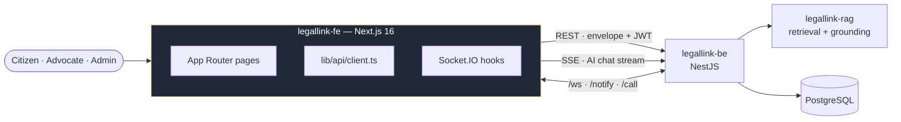

# LegalLink — Frontend

Bilingual (English / বাংলা) legal-aid client for West Bengal. A citizen describes a problem in
plain language; a grounded AI assistant answers with **real, clickable statute citations**, then
routes them to a **Bar Council–verified advocate** for consultation, chat, calls and scheduling.

This is the browser client for [`legallink-be`](https://github.com/Hexabytes-Surtech/legallink-be).
It talks to nothing else directly.

---

## Where this sits



---

## Stack

| Area | Choice |
|---|---|
| Framework | Next.js 16 (App Router, Turbopack), React 19 |
| Language | TypeScript (strict) |
| Styling | Tailwind CSS v4 — CSS-first `@theme`, no `tailwind.config.js` |
| Components | Hand-written Shadcn-style primitives on Radix (no CLI) |
| Theming | `next-themes` — dark default + light, tokens in `globals.css` |
| Real-time | `socket.io-client` (chat, notifications, WebRTC signalling) |
| Streaming | `fetch` + `ReadableStream` SSE parser (`streamPost`) |
| i18n | Context + key catalog (`src/i18n/config.ts`), EN + BN |

---

## Quick start

```bash
npm install
npm run dev      # http://localhost:3000
npm run build && npm run start
npm run lint
```

`.env`:

```env
NEXT_PUBLIC_API_URL=http://localhost:4000/api   # backend REST base
NEXT_PUBLIC_WS_URL=http://localhost:4000        # Socket.IO origin
NEXT_PUBLIC_SITE_URL=http://localhost:3000      # canonical URL for SEO metadata
NEXT_PUBLIC_USE_MOCK=false
```

> No AI provider key belongs in this repo. `NEXT_PUBLIC_*` values ship to the browser, so voice
> transcription records audio here and sends it to the backend to transcribe — the model key
> stays server-side.

Run the backend on `:4000` for live data; the UI renders its loading, empty and error states
without one.

---

## Structure

```
src/
├─ app/
│  ├─ (public)/                  # no auth
│  │  ├─ page.tsx                # landing + intake
│  │  ├─ assistant/              # grounded AI triage chat (anonymous)
│  │  ├─ auth/                   # OTP login / signup / advocate signup
│  │  └─ (with-nav)/             # intake, matter/[id]
│  └─ (protected)/               # AuthGate in layout
│     ├─ (citizen)/              # ask, dashboard, matters, advocates, messages, profile
│     ├─ advocate/               # dashboard, consultations, availability, billing,
│     │                          # reviews, onboarding, messages, profile
│     ├─ admin/                  # verification queue, moderation, reports
│     └─ settings/
├─ components/
│  ├─ ui/          # primitives (button, dialog, sidebar, …)
│  ├─ features/    # domain components — ai-chat, ai-brief, connect-dialog, chat-room,
│  │               # slot-picker, call/, voice-recorder-bar, citation-chip, …
│  ├─ aceternity/  # showpiece backgrounds
│  └─ shared/      # navbar, footer, toggles, empty states
├─ contexts/       # Auth, Language, Realtime, Call, AvatarViewer, PwaInstall
├─ hooks/          # useApi, useChatSocket, useNotificationsSocket, useVoiceTranscription
├─ lib/
│  ├─ api/client.ts  # fetch wrapper: envelope, JWT, 401-refresh-retry, streamPost
│  ├─ markdown.tsx   # dependency-free renderer + inline [n] citation chips
│  └─ call/          # WebRTC helpers
├─ i18n/config.ts   # EN + BN key catalog
└─ types/index.ts   # backend request/response shapes (single source)
```

---

## How data moves

**REST** — every call goes through `lib/api/client.ts`, which speaks the backend envelope
(`{ success, data | error, meta }`), attaches the bearer token, sends cookies for the anonymous
session, and transparently refreshes once on a 401. Pages use `useQuery` / `useMutation`
(`hooks/useApi.ts`) rather than calling `fetch` directly — `loading` drives skeletons everywhere.

**AI chat (SSE)** — `components/features/ai-chat.tsx` posts to
`/ai/conversation/:id/message/stream` via `streamPost` and renders events as they arrive:

| Event | Rendered as |
|---|---|
| `step` | live agent trail — analysing, searching, writing |
| `source` | numbered, clickable source chips |
| `token` | the answer typing out |
| `done` | final state — phase, suggested steps, emergency contacts, `readyToConnect` |

Inline `[n]` markers in the answer become clickable citation chips linked to the matching source.
When a turn is classified as an active emergency, the UI switches to an immediate-help card that
leads with the protective provisions rather than with prose.

**Sockets** — three namespaces: `/ws` (consultation chat and Rule 36 "under review" warnings),
`/notify` (notification badges), `/call` (WebRTC signalling).

---

## Conventions

- **Auth** is two-step OTP, no passwords. Anonymous matters and chats are claimed on verify.
  Role redirects: citizen → `/dashboard`, advocate → `/advocate/dashboard`, admin → `/admin`.
- **Adding a string** — add the key to **both** `en` and `bn` in `src/i18n/config.ts`.
  `TranslationKey` is derived from the `en` set; missing `bn` keys fall back to `en`.
- **Adding a primitive** — hand-write it in `components/ui/` with `cn()` and the design tokens.
- **IST scheduling** — advocate availability is IST wall-clock; `slot-picker` converts the chosen
  slot to a UTC instant before sending `scheduledAt`. `day_of_week` is `0 = Mon … 6 = Sun`.
- **BCI Rule 36** — consultations are verified-advocate-only, chat blocks contact and fee
  solicitation, and advocate bios may not advertise fees or outcomes. The UI enforces and hints
  at these rather than relying on the backend alone.
- **Next.js 16** — see `AGENTS.md`. Several App Router APIs differ from earlier versions; check
  `node_modules/next/dist/docs/` before reaching for a remembered pattern.

---

## Related

| Repo | Role |
|---|---|
| [legallink-be](https://github.com/Hexabytes-Surtech/legallink-be) | API, auth, real-time, orchestration |
| [legallink-rag](https://github.com/Hexabytes-Surtech/legalLink-rag) | Legal retrieval and grounded briefs |

Hexabytes SurTech
